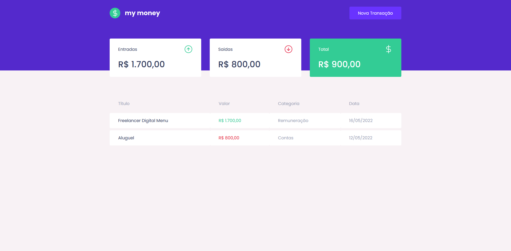
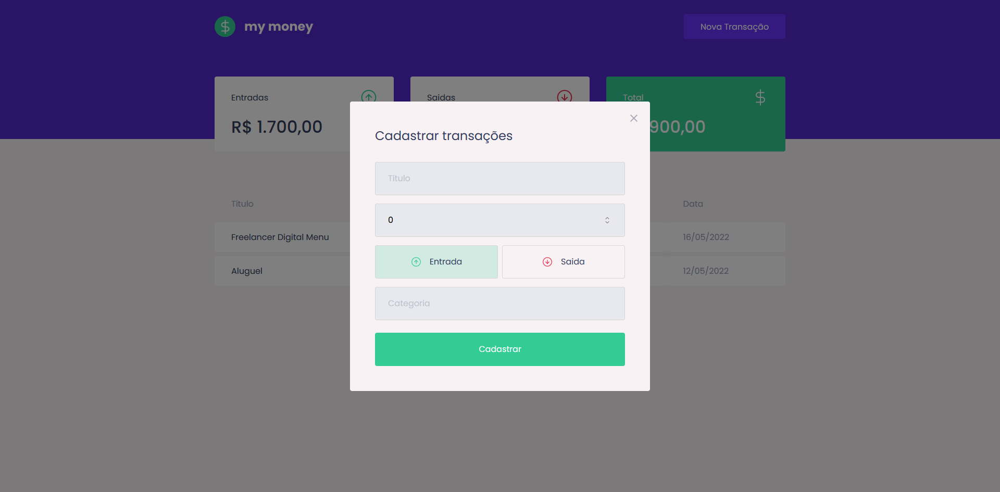

# My Money

This project was created on [Ignite Bootcamp](rocketseat.com.br/ignite).

You can clone and use it to study, sell, edit, whatever!

## Some Images

## Technologies

This project use modern libraries like:

- [ReactJS](reactjs.org) - Framework JS to build web applications
- [MirageJS](https://miragejs.com/) - Fake API to help frontend
- [Axios](https://axios-http.com/ptbr/docs/intro) - HTTP Client
- [Styled Components](https://styled-components.com/) - Library to use component-level styles

## How run it

1. First clone the repo
2. `npm run i`
3. `npm run start`
4. Is it :D
